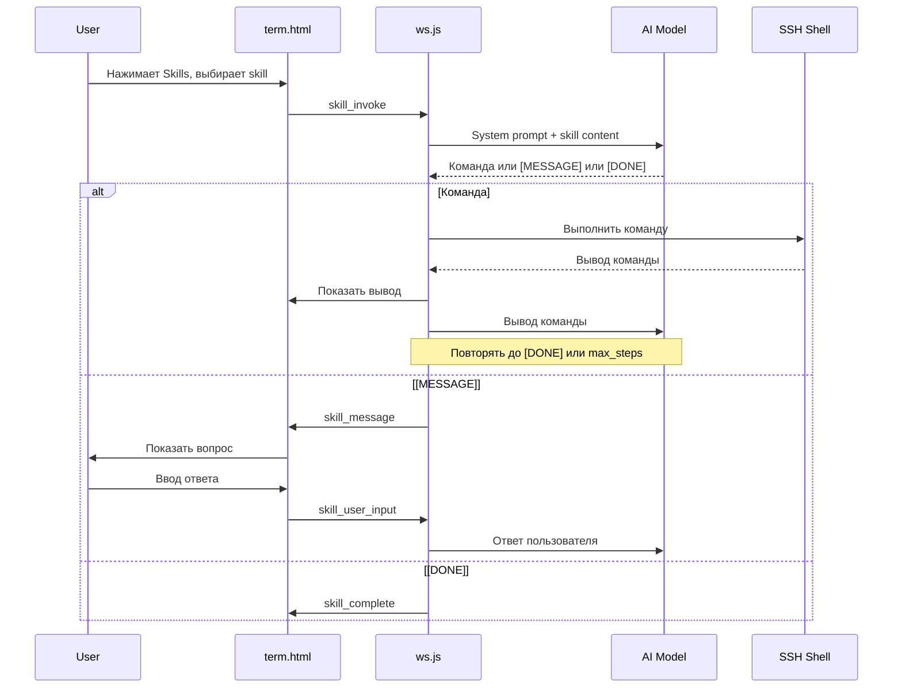

---

name: Multi-step Skill

overview: Реализация многошагового skill с итеративным взаимодействием с AI, сбором вывода команд и возможностью запроса ввода от пользователя.

todos:

  - id: skill-state

    content: Добавить состояние activeSkill в handleTerminal

    status: completed

  - id: skill-prompt

    content: Обновить системный промпт для структурированных ответов [CMD]/[MESSAGE]/[DONE]

    status: completed

  - id: skill-invoke

    content: Переписать обработчик skill_invoke с инициализацией итеративного цикла

    status: completed

  - id: skill-output

    content: Добавить хук в checkForPromptAndFlush для продолжения skill после команды

    status: completed

  - id: skill-user-input

    content: Добавить обработчик skill_user_input

    status: completed

  - id: skill-ui

    content: Обновить UI в term.html для skill messages и ввода

    status: completed

  - id: skill-docs

    content: Обновить документацию README_AI.md

    status: completed

isProject: false

---

  

# Multi-step Skill Implementation

  

## Архитектура

  



  

## Изменения

  

### 1. Состояние активного skill в [server/ws.js](server/ws.js)

  

Добавить в начало `handleTerminal`:

  

```javascript

let activeSkill = null; // { name, systemPrompt, messages: [], step: 0 }

```

  

### 2. Новый формат ответа AI

  

Системный промпт для skill будет требовать структурированный ответ:

  

```

Respond in ONE of these formats:

1. [CMD] command_here - execute shell command

2. [MESSAGE] text - show message to user and wait for input  

3. [DONE] text - skill completed, show final message

  

Always use exactly one format per response.

```

  

### 3. Обработка skill_invoke (переписать строки 462-595)

  

- Инициализировать `activeSkill` с историей сообщений

- Первый запрос к AI

- Обработать ответ (CMD/MESSAGE/DONE)

  

### 4. Новый обработчик skill_user_input

  

Когда пользователь отвечает на вопрос от skill:

  

- Добавить ответ в `activeSkill.messages`

- Отправить следующий запрос к AI

  

### 5. Хук на вывод команды

  

После выполнения команды (когда появляется prompt):

  

- Собрать вывод команды

- Добавить в `activeSkill.messages`

- Отправить следующий запрос к AI

- Проверить `activeSkill.step < 10`

  

### 6. Новые WS-сообщения (клиент -> сервер)

  

```javascript

{ type: 'skill_user_input', text: 'user response' }

{ type: 'skill_cancel' }

```

  

### 7. Новые WS-сообщения (сервер -> клиент)

  

```javascript

{ type: 'skill_message', text: 'question from AI' }

{ type: 'skill_complete', text: 'final message' }

{ type: 'skill_step', step: 3, max: 10 }

```

  

### 8. UI для ввода ответа в [web/term.html](web/term.html)

  

Добавить в skills popup:

  

- Показ сообщения от AI

- Поле ввода ответа

- Кнопки "Отправить" и "Отменить skill"

  

## Ключевые моменты реализации

  

### Сбор вывода команды

  

Использовать существующий `checkForPromptAndFlush` (строка 334). Когда команда завершается (обнаружен prompt), если `activeSkill` активен - отправить вывод в AI.

  

### История сообщений

  

```javascript

activeSkill.messages = [

  { role: 'system', content: systemPrompt },

  { role: 'user', content: 'Execute skill' },

  { role: 'assistant', content: '[CMD] git status --porcelain' },

  { role: 'user', content: 'Command output:\n M file.txt' },

  { role: 'assistant', content: '[MESSAGE] Enter commit message:' },

  { role: 'user', content: 'fix: updated file' },

  { role: 'assistant', content: '[CMD] git add . && git commit -m "fix: updated file"' },

  ...

]

```

  

### Защита от зацикливания

  

- Счётчик `activeSkill.step` (max 10)

- Таймаут на ожидание вывода команды (30 сек)

- Кнопка отмены для пользователя

  

## Файлы для изменения

  

| Файл | Изменения |

  

|------|-----------|

  

| `server/ws.js` | Состояние skill, обработка итераций, новые WS handlers |

  

| `web/term.html` | UI для сообщений и ввода ответа |

  

| `KB/README_AI.md` | Документация нового формата skill |