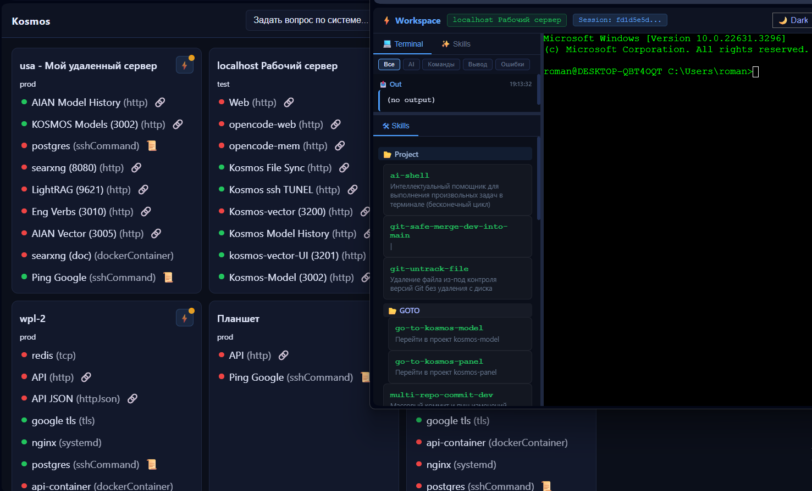

# Kosmos Panel — панель мониторинга сервисов на разных серверах

Агент‑less панель в стиле «космической приборки»: опрашивает сервера по SSH/HTTP/TCP, показывает статусы, даёт быстрый доступ к терминалу (xterm.js) и хвостам логов. **Встроенный AI-помощник** преобразует команды на естественном языке в shell-команды прямо в терминале. Фронт — чистый JavaScript, бэк — Node.js.

Agentless dashboard in a "space cockpit" style: polls servers via SSH/HTTP/TCP, displays their statuses, and provides quick access to the terminal (xterm.js) and log tails. Built-in AI assistant converts natural language commands into shell commands directly in the terminal. Frontend — pure JavaScript, backend — Node.js.



[](https://youtu.be/FboP_IKQ5RM)

[](https://youtu.be/UVaPy5kZiiE)

## Возможности
- Мониторинг без агентов:
  - HTTP, HTTP JSON (JSONPath), TCP порт, TLS срок сертификата
  - systemd unit, произвольная SSH‑команда (regex‑паттерн успешности)
  - Docker контейнер (через `docker ps` по SSH)
- Плитки серверов (цвет: green/yellow/red/gray), тултипы со сводкой
- **Просмотр логов команд**: Для `sshCommand` сервисов доступен просмотр полного вывода команды прямо в интерфейсе.
- **Стабильный порядок серверов**: плитки отображаются в том же порядке, что задан в `inventory.json`
- **Рабочая Панель (Workspace)**: Единый интерфейс (три панели: терминал, логи, skills) с настраиваемым размером (`/workspace.html`).
- Быстрые действия: терминал SSH (xterm.js), tail логов, ssh:// и копирование команды.
- **Legacy**: Поддержка отдельной вкладки терминала (`/term.html`) сохранена как опция.
- **AI-команды в терминале**: введите `ai: ваш запрос` и получите готовую shell-команду
- **Автоопределение ОС**: система автоматически определяет тип ОС (Linux/macOS/Windows) при подключении и генерирует команды для правильной платформы
- **AI Skills**: многошаговые сценарии для автоматизации типовых задач (загрузка из локального проекта и удалённого сервера)
- **Контекст для AI**: создайте `./.kosmos-panel/kosmos-panel.md` или `~/.config/kosmos-panel/kosmos-panel.md` на удалённом сервере для подгрузки специфичных знаний
- **Логирование команд**: все взаимодействия с терминалом записываются со связями между AI запросами, командами и результатами, с указанием сервера
- Горячая перезагрузка `inventory.json` (без рестартов)

## Быстрый старт
Требования: Node.js 18+ или [Bun](https://bun.sh). По умолчанию `npm start` запускает через Bun; для Node: `npm run start:node`.
```bash
npm install
npm start
```
Откройте `http://localhost:3000`. 

## Конфигурация

Проект настраивается через два основных файла:

1.  **`inventory.json`** — определяет список серверов, их сервисы и привязанные к ним учетные данные для SSH. Файл автоматически перезагружается при изменениях.
2.  **`.env`** — используется для хранения секретов: паролей, парольных фраз и путей к SSH-ключам. Создайте его в корне проекта по примеру `.env.example`.

### `inventory.json`

Минимальный пример:
```json
{
  "credentials": [
    {
      "id": "cred-sample",
      "type": "ssh-key",
      "privateKeyPath": "C:/Users/you/.ssh/id_ed25519",
      "passphrase": null,
      "useAgent": false
    }
  ],
  "servers": [
    {
      "id": "usa",
      "name": "usa",
      "env": "prod",
      "ssh": { "host": "usa", "port": 22, "user": "root", "credentialId": "cred-sample" },
      "services": [
        { "id": "web", "type": "http", "name": "Web", "url": "http://usa:3002", "expectStatus": 200 }
      ]
    }
  ],
  "poll": { "intervalSec": 15, "concurrency": 6 }
}
```
Поддерживаемые сервисы: `http`, `httpJson`, `tcp`, `tls`, `systemd`, `sshCommand`, `dockerContainer`. Подробно про SSH/креды/отладку — `README_AUTH.md`.

### `.env`

Этот файл используется для хранения чувствительных данных, которые не должны попадать в систему контроля версий. Пример:

```bash
# Путь к приватному SSH-ключу
SSH_KEY_PATH=C:/Users/you/.ssh/id_ed25519

# Парольная фраза для ключа (если есть)
SSH_PASSPHRASE=your_secret_passphrase

# Пароль для SSH-доступа (если не используется ключ)
SSH_PASSWORD=your_secret_password

# Использовать ли SSH-агент (true/false)
USE_SSH_AGENT=false

# AI Configuration (для AI-команд в терминале)
AI_SERVER_URL=http://localhost:3002/api/send-request
AI_MODEL=moonshotai/kimi-dev-72b:free
AI_PROVIDER=openroute
AI_SYSTEM_PROMPT=You are a terminal AI assistant. Your task is to convert the user's request into a valid shell command, and return ONLY the shell command itself without any explanation.
```

Значения из этого файла подставляются в `inventory.json`, если там используются плейсхолдеры. 

- **Поддерживаемый синтаксис**: `${VAR_NAME}` и `$VAR_NAME`.
- **Горячая перезагрузка**: Изменения в `.env` применяются "на лету" после перезагрузки конфигурации через UI (кнопка "Перезагрузить") или через API (`POST /api/reload`), **без необходимости перезапуска сервера**.
- **Логирование**: При перезагрузке конфигурации в консоли сервера отображаются все использованные переменные и выводятся предупреждения о тех, что не были найдены.

## Интерфейс
- Плитки → hover: тултип; click: меню действий
- Меню: открыть Workspace, терминал в новой вкладке (`/term.html`), tail, SSH-ссылки.
- Терминал — xterm.js: цвета, UTF‑8, прокрутка; ввод идёт прямо в терминал
- **AI-команды**: `ai: покажи файлы` → автоматически выполнится `ls -la`
- **Просмотр логов команд**: интерактивная панель при наведении + страницы `/logs.html` (фильтр по сессии: текущая/все, и по типу) и `/raw-logs.html` (сырой JSON)
- **Редактор конфигурации**: доступен по ссылке "⚙️ Настройки" или `/inventory-editor-react.html`
- **Стабильный порядок серверов**: плитки серверов отображаются в том же порядке, что определен в `inventory.json`

📖 **Подробная документация (база знаний):** оглавление — [KB/README_INDEX.md](KB/README_INDEX.md).
- **Терминал (WebSocket, REST API, логи, AI, Skills)**: [KB/README_terminal.md](KB/README_terminal.md). История команд: `logs/terminal/terminal_log.json`, `GET /api/logs`, UI — `/logs.html`, `/raw-logs.html`

### Редактор inventory.json

Встроенный веб-редактор для управления конфигурацией серверов и мониторинга:

**Возможности:**
- ✅ **Валидация в реальном времени** — проверка JSON синтаксиса и структуры
- ✅ **Предварительный просмотр** — визуализация серверов, сервисов и учетных данных
- ✅ **Навигация по серверам** — быстрый переход к нужному серверу в JSON
- ✅ **Автоматическое форматирование** — красивое оформление JSON
- ✅ **Резервное копирование** — автоматические backup'ы при сохранении
- ✅ **Валидация данных** — проверка обязательных полей и уникальности ID
- ✅ **Горячие клавиши** — Ctrl+S (сохранить), Ctrl+Shift+F (форматировать)
- ✅ **Шаблоны** — быстрое добавление новых серверов и учетных данных

**Интерфейс:**
- **Вкладка JSON** — редактор с подсветкой синтаксиса и валидацией
- **Вкладка "Предварительный просмотр"** — структурированное отображение конфигурации
- **Боковая панель** — список серверов для быстрой навигации
- **Статус-бар** — позиция курсора, размер файла, статус валидации
- **Кнопки действий** — сохранить, перезагрузить, проверить, форматировать

**Доступ:**
```
http://localhost:3000/inventory-editor-react.html
```

Или через кнопку "⚙️ Настройки" в верхней панели главной страницы.

📖 **Подробная документация**: см. вкладки и справку в самом редакторе; общая конфигурация — [KB/README_AUTH.md](KB/README_AUTH.md)

## API/WS

### REST API
- `GET /api/servers` — состояние всех серверов и сервисов (порядок как в inventory)
- `GET /api/inventory` — конфигурация (сервера, креды, poll)
- `GET /inventory.json` — полный файл конфигурации (для редактора)
- `POST /api/inventory` — сохранить конфигурацию (валидация, backup)
- `POST /api/reload` — перезагрузить конфигурацию из `inventory.json` и `.env`
- `GET /api/test-ssh?serverId=...` — тест SSH-подключения
- `GET /api/logs` — лог терминальных команд (JSON)
- `GET /api/service-log?serverId=...&serviceId=...` — вывод команды для сервиса типа `sshCommand`
- **Терминал REST**: `POST /api/v1/terminal/sessions`, `.../sessions/:id/exec`, `DELETE .../sessions/:id`; то же для v2
- **Skills**: `GET/POST` по `/api/skills` (см. AI Skills в интерфейсе)

### WebSocket
- `/ws/terminal?serverId=...&cols=120&rows=30` — интерактивный SSH-терминал
- `/ws/tail?serverId=...&path=/var/log/syslog&lines=200` — отслеживание логов

**Сообщения WS:**
```json
{
  "type": "data|err|fatal|ai_query|command_log",
  "data": "содержимое для вывода",
  "error": "сообщение об ошибке", 
  "prompt": "AI-запрос пользователя",
  "command": "команда для логирования"
}
```

**Примечание:** Все записи в `logs/terminal/terminal_log.json` автоматически содержат информацию о сервере (`serverId`, `serverName`, `serverHost`) для различения команд от разных серверов.

## Известные проблемы и решения

### Порядок отображения серверов на главной странице

**Проблема:** Плитки серверов меняли местоположение при каждом обновлении страницы, не сохраняя порядок из конфигурации.

**Решение:** В версии от 2024-12-19 исправлена логика формирования API-ответа в `server.js` (маршрут `GET /api/servers`). Теперь порядок серверов на главной странице строго соответствует порядку в файле `inventory.json`.

**Технические детали:**
- Ранее использовался `Object.values(snap.servers)`, который не гарантирует порядок элементов объекта
- Теперь используется порядок из оригинального массива `inventory.servers` с фильтрацией существующих серверов
- Изменения применяются автоматически после перезапуска сервера

## Структура проекта
- **Корень**: `server.js` — точка входа, Express, статика `web/`, маршруты API и WS
- **server/** — бэкенд: `monitor.js` (опрос серверов, inventory), `ws.js` (терминал, tail), `terminal.js` (REST API v1/v2), `ws-utils.js` (SSH), `logger.js`, `skills.js`, `skill-ai.js`
- **web/** — фронт: `workspace.html` (основной интерфейс), `workspace.js`, `workspace.css`, `index.html`, `app.js`, `term.html` (legacy), `logs.html` (legacy), `inventory-editor-react.html`.
- **KB/** — документация: `README_AUTH.md`, `README_AI.md` и др.
- **tests/** — интеграционные тесты (например `test_usa_v2.js`)